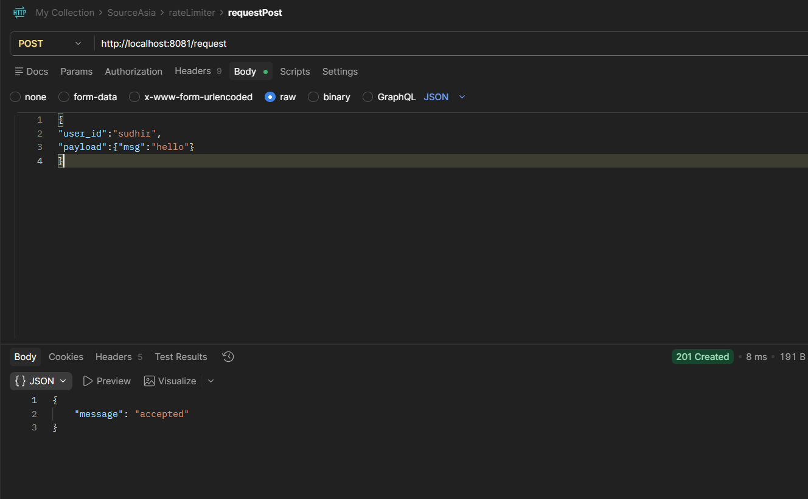
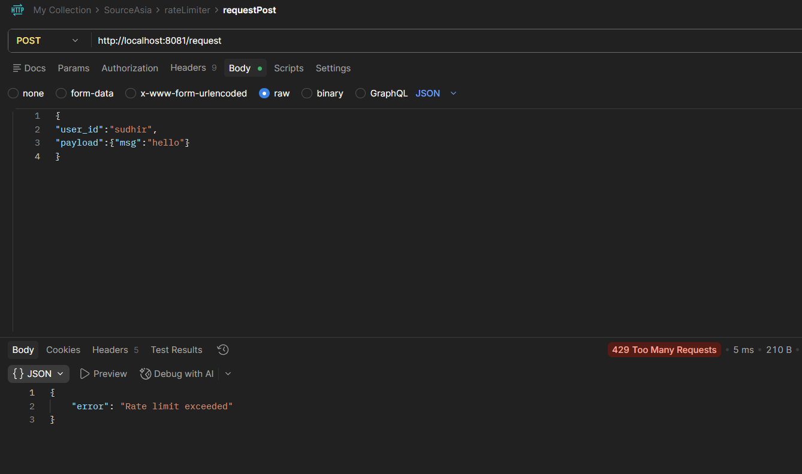
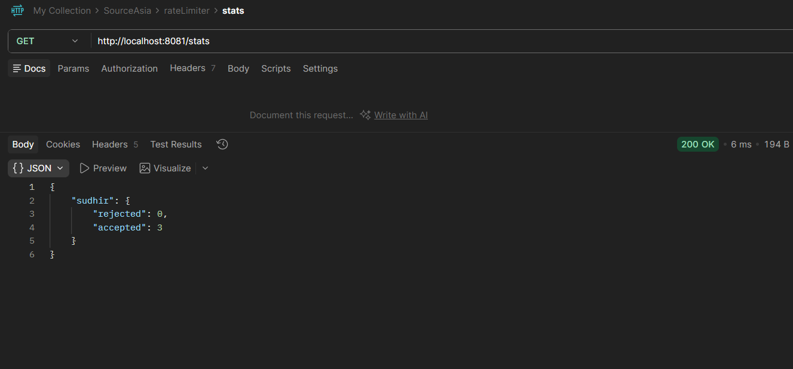
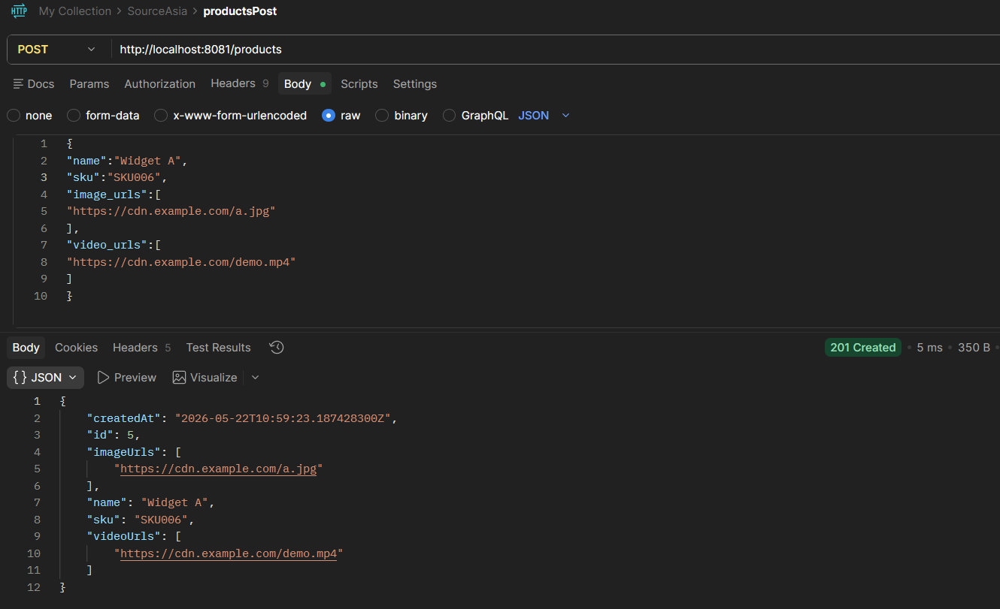
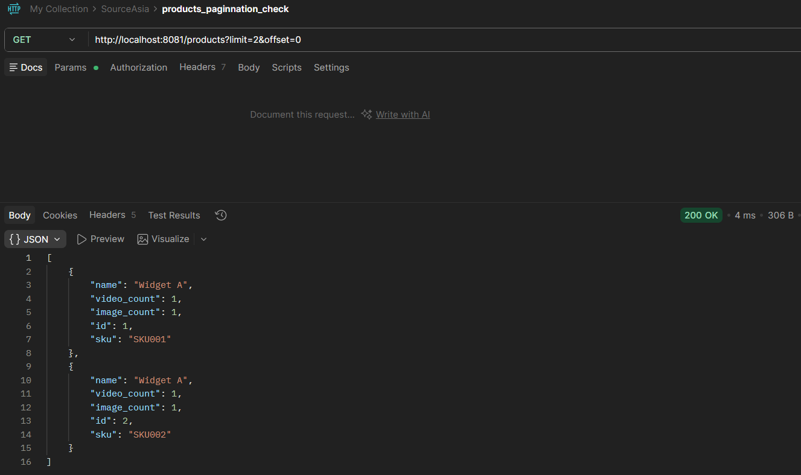
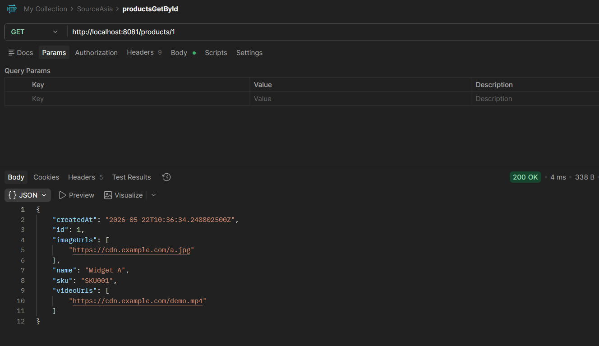
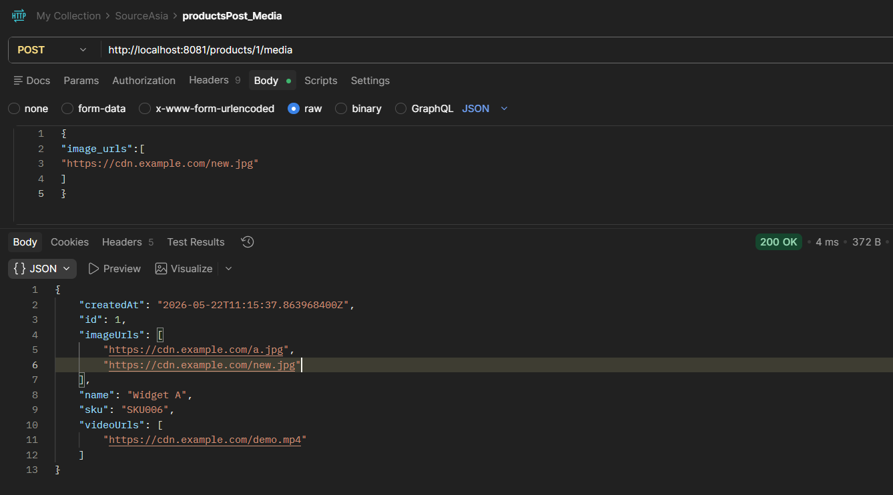

# Source Asia – Backend Assignment

Backend assignment submission for Source Asia.

This project implements:

- Part 1 – Rate-Limited API
- Part 2 – Product Catalog with Media

Built using Java + Spring Boot with in-memory storage.

---

# Tech Stack

- Java 23
- Spring Boot 3
- Maven
- Embedded Tomcat
- Postman
- ConcurrentHashMap
- REST APIs

---

# Project Structure

```text
src/
├── rateLimiter/
│   ├── controller/
│   ├── service/
│   └── model/
│
├── catalog/
│   ├── controller/
│   ├── service/
│   └── model/
│
├── Exceptions/
└── resources/
```

---

# Setup & Run

## Clone

```bash
git clone <repo-url>
cd <repo>
```

## Run

```bash
mvn spring-boot:run
```

Server:

```text
http://localhost:8081
```

(Port can be changed using `application.properties`)

---

# Part 1 – Rate Limited API

Implements request throttling per user.

## Endpoint

### POST /request

Request

```json
{
  "user_id":"sudhir",
  "payload":{
    "msg":"hello"
  }
}
```

Success

```json
{
  "message":"accepted"
}
```

Response:

```text
201 Created
```

Rate limit exceeded:

```json
{
  "error":"Rate limit exceeded"
}
```

Response:

```text
429 Too Many Requests
```

---

### GET /stats

Returns request statistics.

Example:

```json
{
  "sudhir":{
    "accepted":3,
    "rejected":0
  }
}
```

---

# Rate Limiting Design

Approach used:

- Rolling 1-minute window
- Maximum 5 accepted requests per user
- Concurrency-safe implementation
- Per-user synchronization
- In-memory request tracking

Storage:

```text
ConcurrentHashMap<String, UserStats>
```

---

# Part 2 – Product Catalog with Media

Supports products containing multiple image and video URLs.

---

## Create Product

### POST /products

Request:

```json
{
"name":"Widget A",
"sku":"SKU001",
"image_urls":[
"https://cdn.example.com/a.jpg"
],
"video_urls":[
"https://cdn.example.com/demo.mp4"
]
}
```

Response:

```text
201 Created
```

---

## Product List

### GET /products

Supports pagination.

Example:

```text
/products?limit=2&offset=0
```

List response intentionally excludes media arrays.

Example:

```json
[
{
"id":1,
"name":"Widget A",
"sku":"SKU001",
"image_count":1,
"video_count":1
}
]
```

---

## Product Detail

### GET /products/{id}

Returns complete product.

Example:

```json
{
"id":1,
"name":"Widget A",
"imageUrls":[
"https://cdn.example.com/a.jpg"
]
}
```

---

## Add Media

### POST /products/{id}/media

Request:

```json
{
"image_urls":[
"https://cdn.example.com/new.jpg"
]
}
```

Response:

Returns updated product.

---

# Validation Rules

Implemented validations:

- Empty product name rejected
- Empty SKU rejected
- Duplicate SKU rejected
- Invalid URLs rejected
- Maximum URL limit enforced
- Unknown product returns 404
- Empty media request returns 400

---

# Pagination

Implemented using:

```text
limit
offset
```

Example:

```text
/products?limit=2&offset=0
```

Design goal:

Avoid loading or returning all media URLs for list views.

---

# Production Limitations

Current implementation:

- In-memory storage only
- Data lost after restart
- Single-instance deployment
- No persistence layer
- No distributed rate limiting

Production improvements:

- PostgreSQL
- Redis for rate limiting
- CDN for media
- Docker deployment

---

# API Demo Screenshots

## Rate Limit Success



---

## Rate Limit Exceeded



---

## Stats



---

## Product Create



---

## Product Pagination



---

## Product Detail



---

## Add Media



---

# AI Usage Note

AI tools were used for:

- brainstorming API structure
- reviewing edge cases
- validating design decisions

Final implementation, testing, debugging, and integration were completed manually.

---
